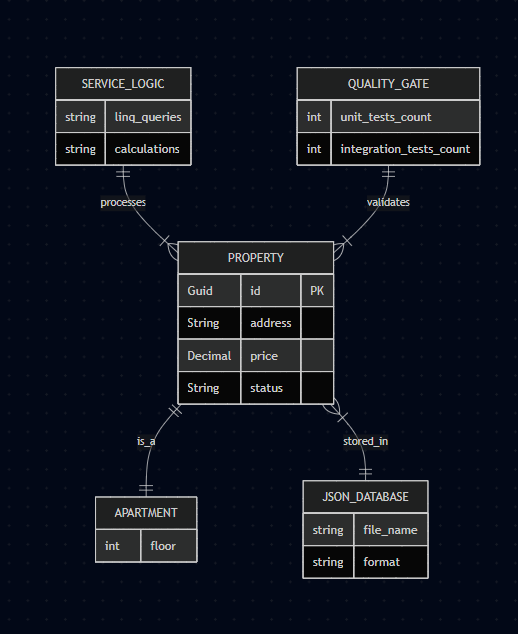

# Real Estate Agency

**Real Estate Agency** - це консольна CRM-система для автоматизації роботи агентства нерухомості. Проєкт розроблено як підсумковий капстоун-проєкт, що демонструє володіння стеком технологій .NET та принципами чистої архітектури.

---

## Ключові можливості
* **Управління об'єктами:** Додавання та облік квартир і будинків з валідацією даних.
* **Бізнес-аналітика:** Використання LINQ для розрахунку загальної вартості портфеля та групування об'єктів.
* **Надійне збереження:** Асинхронний механізм Persistence через JSON-сховище.
* **Fault Tolerance:** Власна ієрархія доменних винятків для обробки критичних помилок.
* **Якість коду:** Покриття Unit та Integration тестами (>80% coverage).

---

## Архітектура проєкту
Проєкт побудований на принципах **Layered Architecture** та **SOLID**:

* **RealEstate.Domain**: Ядро системи. Містить сутності (`Property`, `Apartment`), доменні винятки та інтерфейси репозиторіїв.
* **RealEstate.Application**: Логіка Use Cases. Сервіси для аналітики, пошуку та координації дій.
* **RealEstate.Infrastructure**: Реалізація збереження даних (File-based JSON).
* **RealEstate.Console**: Рівень представлення та взаємодії з користувачем.

---

## Технологічний стек
* **Мова:** C# 12 / .NET 8
* **Тестування:** xUnit, Moq, Coverlet
* **Persistence:** System.Text.Json (Async I/O)
* **Патерни:** Strategy (для розрахунку комісій), Repository (для абстракції даних), Dependency Injection.

---

## Швидкий старт

### Системні вимоги
* .NET 8.0 SDK або вище

### Запуск додатку
```powershell
# Клонування репозиторію
git clone <url-твого-репозиторію>

# Перехід у папку консольного клієнта
cd src/RealEstate.Console

# Запуск
dotnet run
```

## Скрін оновленої ER-діаграми з 34 по 37 лабораторні
