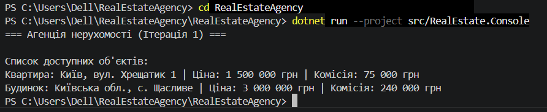

# Демонстрація роботи програми

## Запуск програми
Для запуску використовується команда:
`dotnet run --project src/RealEstate.Console`

## Скріншоти результатів

На скріншоті видно успішний вивід:
1. Заголовок ітерації.
2. Розраховані ціни та комісії для Квартири та Будинку.