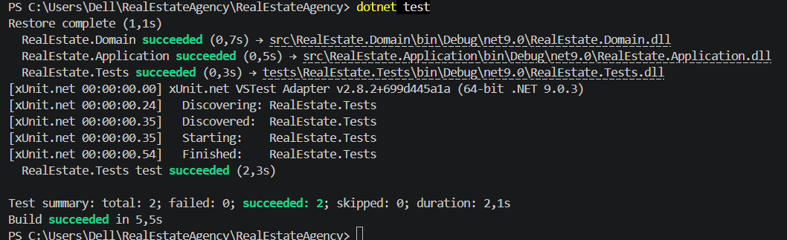

# Звіт про тестування (Ітерація 1)

## 1. Юніт-тести
Було реалізовано тести для перевірки бізнес-логіки розрахунку комісії:
- **Apartment_Commission_IsCorrect**: Перевірка 5% комісії для квартир.
- **House_Commission_IsCorrect**: Перевірка 8% комісії для будинків.
- **NegativePrice_ThrowsException**: Перевірка захисту від некоректних даних.

## 2. Ручне тестування (Console UI)
- **Сценарій**: Запуск програми та виведення каталогу.
- **Очікуваний результат**: Програма виводить список об'єктів з розрахованими сумами.
- **Фактичний результат**: Дані відображаються коректно 
## Результат тестів
