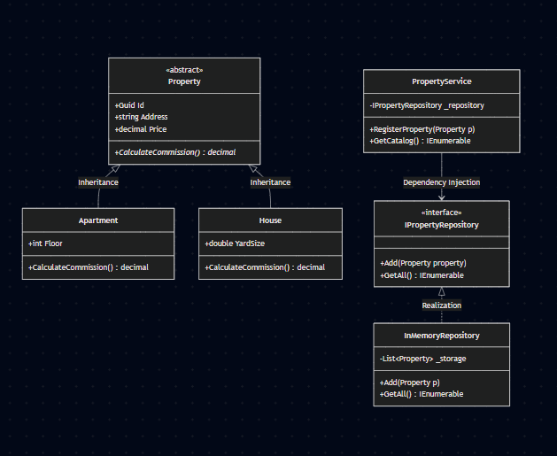

# UML Class Diagram - Iteration 1

classDiagram
    class Property {
        <<abstract>>
        +Guid Id
        +string Address
        +decimal Price
        +CalculateCommission()* decimal
    }
    
    class Apartment {
        +int Floor
        +CalculateCommission() decimal
    }
    
    class House {
        +double YardSize
        +CalculateCommission() decimal
    }
    
    class IPropertyRepository {
        <<interface>>
        +Add(Property property)
        +GetAll() IEnumerable
    }
    
    class PropertyService {
        -IPropertyRepository _repository
        +RegisterProperty(Property p)
        +GetCatalog() IEnumerable
    }
    
    class InMemoryRepository {
        -List~Property~ _storage
        +Add(Property p)
        +GetAll() IEnumerable
    }

    Property <|-- Apartment : Inheritance
    Property <|-- House : Inheritance
    IPropertyRepository <|.. InMemoryRepository : Realization
    PropertyService --> IPropertyRepository : Dependency Injection
## Скрін UML-діаграми
