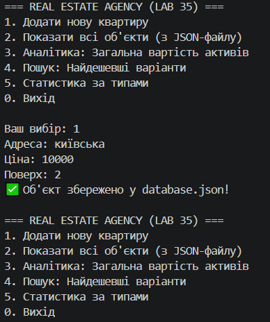

# Звіт за ітерацію №2 (Lab 35)

## 1. Реалізовані сценарії (Use Cases)
* **Збереження та відновлення:** Реалізовано через `FilePropertyRepository`, дані зберігаються у `database.json`.
* **Аналітика:** Додано розрахунок загальної вартості портфеля та статистику за типами об'єктів.
* **Пошук:** Реалізовано фільтрацію за бюджетом з використанням LINQ.

## 2. Бізнес-правила (Domain Rules)
1. Ціна об'єкта не може бути від'ємною або нульовою (перевірка в конструкторі).
2. Об'єкт має статус (`Available`, `Sold`).
3. Заборонено змінювати статус уже проданого об'єкта (викидається `InvalidOperationException`).

## 3. Патерни проєктування
* **Strategy:** Впроваджено інтерфейс `ICommissionStrategy`. Це дозволяє змінювати логіку розрахунку комісії (Standard/Premium), не змінюючи код самих класів нерухомості.

## 4. LINQ-запити
У сервісі `PropertyService` використано:
* `.Where()` - для фільтрації доступних об'єктів та пошуку за ціною.
* `.Sum()` - для агрегації загальної вартості.
* `.OrderBy()` - для сортування за ціною.
* `.GroupBy()` - для групування об'єктів за класом (Apartment/House).

## Скрін виконаної роботи 

