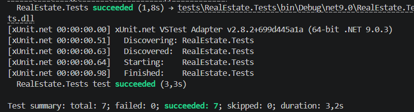

# Стратегія тестування та контролю якості (Lab 36)

## 1. Загальна концепція
Метою цієї ітерації є перехід від простого функціоналу до захищеного рішення через впровадження автоматизованого тестування та обробки виняткових ситуацій (Fault Handling).

## 2. Зони ризику та критичні сценарії
Ми виділили наступні сценарії, які потребують 100% покриття тестами:
* **Цілісність даних:** Створення об'єктів з некоректними параметрами (ціна ≤ 0, порожня адреса).
* **Життєвий цикл:** Спроба змінити статус об'єкта, який вже проданий (`AlreadySoldException`).
* **Збереження стану:** Ризик втрати або пошкодження даних при записі/читанні з JSON-файлу.

## 3. Рівні тестування
### Unit Tests (Юніт-тести)
* **Інструменти:** xUnit, Moq.
* **Об'єкт:** Доменні моделі та `PropertyService`.
* **Підхід:** Використання Moq для ізоляції сервісу від файлової системи. Перевірка "щасливих" та "негативних" сценаріїв.

### Integration Tests (Інтеграційні тести)
* **Об'єкт:** `FilePropertyRepository`.
* **Підхід:** Реальна взаємодія з диском. Використання тимчасових файлів для перевірки повного циклу: "Створення -> Збереження -> Завантаження -> Перевірка".

## 4. Обробка помилок (Fault Handling)
Замість стандартних системних помилок впроваджено власні доменні винятки:
* `InvalidPriceException` - захист від некоректних фінансових даних.
* `AlreadySoldException` - захист бізнес-логіки продажів.
* `InvalidAddressException` - валідація вхідних даних.

---

## 5. Контрольні питання (Відповіді)

### 1. Де у вашому проєкті достатньо unit tests, а де потрібні integration tests?
**Відповідь:** Unit-тести використовуються для швидкої перевірки правил логіки в `Property` та `PropertyService`. Інтеграційні тести потрібні в `Infrastructure` шарі, щоб переконатися, що дані правильно серіалізуються в JSON та не зникають після перезапуску.

### 2. Які зміни в архітектурі були зроблені спеціально заради тестованості?
**Відповідь:** Ми виділили інтерфейс `IPropertyRepository`. Це дозволило нам "підмінити" реальний файл віртуальним об'єктом (Mock) під час тестування сервісу, що робить тести швидкими та незалежними від стану диска.

### 3. Які негативні сценарії були найважливішими і чому?
**Відповідь:** Спроба повторного продажу об'єкта та створення об'єкта з нульовою ціною. Це найважливіші сценарії, бо вони запобігають фінансовим та логічним помилкам у базі даних.

### 4. Чому coverage сам по собі не гарантує якість?
**Відповідь:** Покриття (coverage) лише показує, які рядки коду були запущені. Воно не гарантує, що ми написали правильні `Assert` (перевірки) або що ми врахували всі логічні комбінації вхідних даних.

### 5. Які ризики залишаються перед Lab 37?
**Відповідь:** Залишається ризик одночасного доступу до файлу кількома користувачами (Race Condition) та відсутність валідації форматів даних (наприклад, якщо хтось вручну відредагує JSON-файл і видалить там кому).

## Скрін виконаних тестів 
